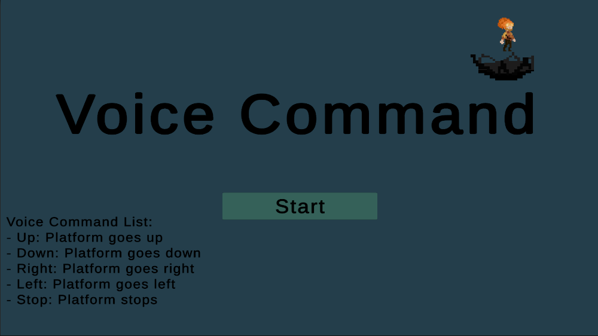

# Voice Command Game

> *A 2D platformer where your voice is the controller.*

---

## Project Thumbnail



---

## Demo Video

(https://youtu.be/LlikJFbui4w)

---

## Team

| Name | Role |
|---|---|
| John Philip Baldonado | Solo Developer |

---

## Project Description

A 2D platformer where you must navigate through obstacles with the help of a moving platform — controlled entirely by your voice. Direct the platform **left**, **right**, **up**, and **down** using simple voice commands to guide your character safely through each level.

This project was inspired by games like **Mage Arena** and **REPO**, which use voice as a core mechanic. I wanted to explore whether voice recognition could feel natural and fun in a platformer setting — and challenge myself to integrate browser-based speech recognition directly into a Unity WebGL game.

> *Requires Chrome or Edge. Allow microphone access when prompted.*

---

## How Does It Work?

```
You speak a command
        ↓
Chrome's Web Speech API converts your voice to text
        ↓
A JavaScript .jslib plugin bridges the browser and Unity
        ↓
The robot platform receives the command and moves
```

| Command | Action |
|---|---|
| `"right"` | Move platform right |
| `"left"` | Move platform left |
| `"up"` | Move platform up |
| `"down"` | Move platform down |
| `"stop"` | Stop the platform |

---

## How Did the Idea Come About?

I've always been fascinated by games that use unconventional input methods. After playing **Mage Arena** and **REPO** — both of which use voice as a core gameplay mechanic — I started wondering: *could I build something like that myself?*

I wanted to see if voice recognition could feel responsive and fun in a platformer context, and whether I could pull it off entirely in the browser without the player needing to download anything. The result is this game — a platformer where one mechanic (your voice) controls everything.

---

## Art & Characters

The game features original pixel art characters hand-crafted for the project:

| Idle | Running | Falling | Jumping |
|---|---|---|---|
|  |  |  |  |

---

## Challenges

### Voice Recognition Integration
The hardest part of this project was getting voice recognition to work inside a browser game. Unity has no built-in speech recognition, so I had to write a custom **JavaScript `.jslib` plugin** to bridge the browser's **Web Speech API** with Unity's game logic. Getting commands to fire reliably and in real time required a lot of testing and debugging — especially issues that only appeared in WebGL builds and not in the Unity Editor.

### Animation Synchronization
Animations proved surprisingly tricky. The robot platform needed smooth transitions between idle, moving, and stopping states. Syncing animations correctly with the state machine — so every movement felt responsive and polished — took significant tweaking.

### WebGL-Specific Debugging
Many bugs only surfaced in the final WebGL build and not during Editor play mode, which made debugging slower and more complex than usual.

---

## What I Learned

- How to connect the browser's **Web Speech API** to Unity using a custom JavaScript `.jslib` plugin
- How to diagnose and fix WebGL-specific issues that don't appear in the Unity Editor, including using `#if UNITY_WEBGL && !UNITY_EDITOR` guards
- Designing scalable systems using the **singleton pattern** for persistent managers across scenes

---

## Final Presentation

[View the Final Presentation Slides](https://canva.link/mnfl6258kcsbk9f)

---

## Built With


- **Engine:** Unity 6 (WebGL / Web build)
- **Voice Recognition:** Web Speech API (Chrome/Edge)
- **JS Bridge:** Custom `.jslib` plugin
- **Platform:** Browser (itch.io)

---

## How to Play

1. Open the game in **Chrome** or **Edge** *(Firefox not supported)*
2. Click **Start** and allow microphone access when prompted
3. Say **"right"**, **"left"**, **"up"**, or **"down"** to move the robot platform
4. Guide your character through the obstacles to reach the goal!

---

## Play Link

(https://sleeptime.itch.io/voice-command-game)
